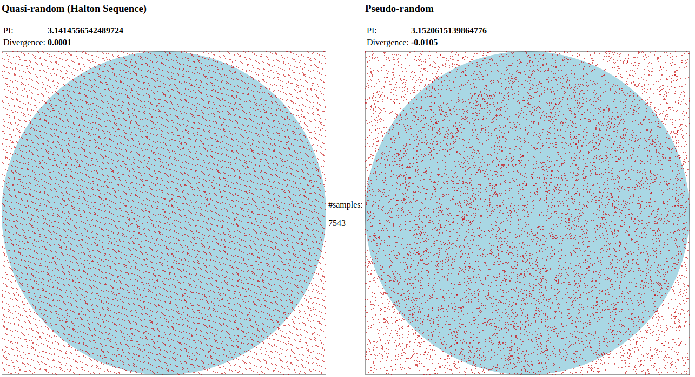

# PI estimation by Monte Carlo simulation
Project in Web Assembly (mosltly C) to observe the difference between Quasi and Pseudo Random number generation.

For demo, click [here](https://leonardoandrade.github.io/montecarlo/)
#### running

1. make all
2. cd docs && python -m SimpleHTTPServer 3000 (or any other static web server)

#### links
This idea is not original, has been implemented several times through the years: 

https://curiosity-driven.org/pi-approximation

http://mathfaculty.fullerton.edu/mathews/n2003/montecarlopimod.html